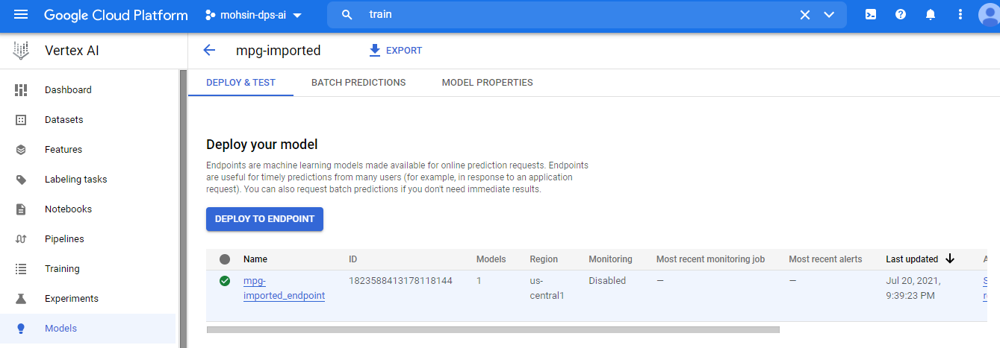

# Digital Product School AI Challenge
First make an account on Google Cloud Platform https://cloud.google.com/.
Then navigate to console tab on the upper right corner.

We start by creating a new project 


Now we open the Command line Interface and Enable our GCloud apis.
```
gcloud services enable compute.googleapis.com         \
containerregistry.googleapis.com  \
aiplatform.googleapis.com
```

Now we create our bucket for this project.
```
BUCKET_NAME=gs://$GOOGLE_CLOUD_PROJECT-bucket
gsutil mb -l us-central1 $BUCKET_NAME
```
here is my bucket name.


Now we create a directory ``` mpg/ ``` 
now in this directory we make the Dockerfile ``` mpg/Dockerfile ``` 
and one more directory ``` mpg/trainer ``` 
with a file ``` mpg/trainer/train.py ```.

We would need replace the bucket name in the training file

```
sed -i "s|BUCKET_NAME|$BUCKET_NAME|g" trainer/train.py
```

Once you have made the appropriate files with the appropriate content we move on to making a container image.
Set the env variable 
``` 
IMAGE_URI="gcr.io/$GOOGLE_CLOUD_PROJECT/mpg:v1" 
```
Run the build command 
```
docker build ./ -t $IMAGE_URI
```
Now push the Image to Registry
```
docker push $IMAGE_URI
```
Here you can see the image in the container registry.


Lets train the model for our problem using Vertex AI Training.


Now once the training is done lets deploy the model. First we install  ``` pip3 install google-cloud-aiplatform --upgrade --user ```.
* make sure you are in the mpg directory

Create a new file ``` mpg/deploy.py ``` and then execute
``` 
python3 deploy.py | tee deploy-output.txt 
```
First it will import the model.


Then it will create an end point of the model.


Now we can observe the endpoint has been created successfully.


For testing the api create a ``` mpg/predct.py ```. replace the end point name with your endpoint name, you can get it from 
``` 
ENDPOINT=$(cat deploy-output.txt | sed -nre 's:.*Resource name\: (.*):\1:p' | tail -1)
sed -i "s|ENDPOINT_STRING|$ENDPOINT|g" predict.py
```

Here are my testing outputs.
```
python3 predict.py

```
